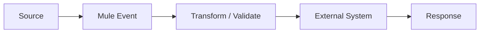

# Canonical Lesson Template

Use this structure when adding or expanding **any** technical topic. Keep the main explanation in one canonical location and link to it from interview, lab and scenario material.

## 1. Topic

**Name:**

**Level:** Beginner / Intermediate / Advanced

**Prerequisites:**

**Version tested:** Mule Runtime / Java / DataWeave / connector / deployment target

## 2. What is it?

Explain it in plain language first. Assume the reader has never seen the concept.

## 3. Why does it exist?

Explain the real problem it solves.

## 4. When should I use it?

Give 2–4 practical situations.

## 5. When should I NOT use it?

Show alternatives and anti-patterns.

## 6. Architecture diagram

```text
Source
  │
  ▼
Mule Event
  │
  ├── Payload
  ├── Attributes
  └── Variables
  │
  ▼
Processor / Connector
  │
  ▼
Target
```

Use Mermaid when useful:



## 7. How it works

Explain the runtime/data movement step by step.

## 8. Smallest working example

Show the minimum implementation needed to understand the idea.

## 9. Input → Code → Output

Always provide concrete data.

```json
{
  "id": 101,
  "name": "Alice"
}
```

```dataweave
%dw 2.0
output application/json
---
{
  customerId: payload.id,
  customerName: payload.name
}
```

```json
{
  "customerId": 101,
  "customerName": "Alice"
}
```

## 10. Realistic example

Use a business scenario such as customer, payment, order, shipment or notification processing. Use synthetic data.

## 11. Mule configuration

Show relevant XML/configuration and explain the important lines. Do not dump unexplained XML.

## 12. Test cases

At minimum:

| Case | Input | Expected |
|---|---|---|
| Happy path | valid data | successful response |
| Missing field | incomplete data | controlled validation error |
| Invalid type | wrong type | predictable error |
| Dependency failure | downstream unavailable | retry/fallback/error strategy |
| Duplicate | same request twice | idempotent behavior where required |

## 13. MUnit strategy

Explain what to mock, what to assert, what to verify and which negative paths matter.

## 14. Failure injection

Intentionally create failures:

- invalid payload
- unavailable dependency
- timeout
- authentication failure
- bad property
- malformed response
- duplicate message
- certificate problem where relevant

Then show how to diagnose each one.

## 15. Troubleshooting table

| Symptom | Evidence to inspect | Likely area | Safe next step |
|---|---|---|---|
| 400 | request/error response | contract/input | inspect payload and validation |
| 401/403 | auth headers/policy logs | security | verify credentials/token/policy |
| 404 | URL/method/APIkit route | routing | verify contract and deployed path |
| 415 | Content-Type | media type | inspect request headers/body |
| 5xx | Mule error/logs | application/dependency | trace correlation ID |
| timeout | latency/logs | dependency/network | isolate slow dependency |

## 16. Security

Cover authentication, authorization, TLS, secrets, PII, safe logging and least privilege where applicable.

## 17. Performance

Explain payload size, streaming, memory, concurrency, connector pools, DB queries and downstream latency where relevant.

## 18. Production operation

Explain:

- logs
- correlation IDs
- metrics
- alerts
- dashboards
- health checks
- runbook
- rollback/recovery

## 19. Beginner exercise

A small task that can be completed in 15–30 minutes.

## 20. Intermediate exercise

A multi-step integration task with an external dependency.

## 21. Advanced challenge

Add scale, failure, security, asynchronous processing, observability or deployment constraints.

## 22. Interview questions

Include:

- definition question
- implementation question
- comparison question
- troubleshooting question
- production scenario
- architecture trade-off

## 23. Common mistakes

List mistakes and explain why they fail.

## 24. Related chapters

Link to the canonical internal chapters. Do not duplicate the full explanation elsewhere.

## 25. Completion gate

The learner must be able to **explain → implement → test → break → debug → secure → deploy → operate → teach** the topic.
